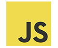

# Stack

A collection of the tools we use at Clockwork. 
If you have a tool you would like to include, create a pull request.
We strongly recommend you checkout the [contribution guide](../../../guides/CONTRIBUTING.md)
before you do. Goodluck!

---

### Languages

### Linters

### Package Managers

### Module Bundlers

### Frameworks

